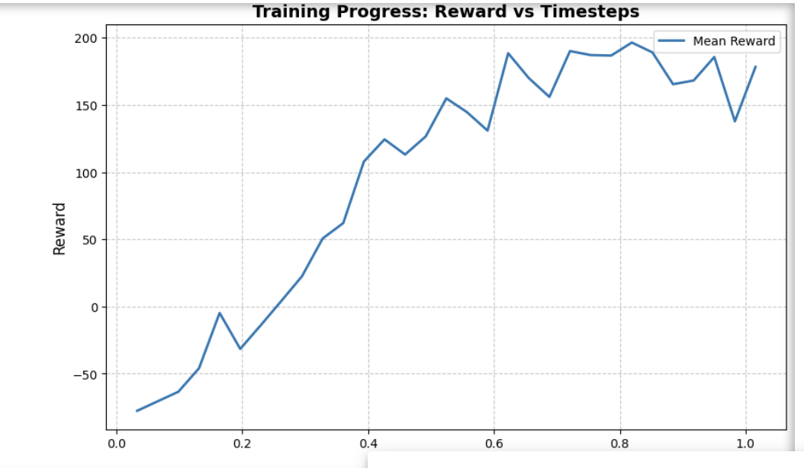

# CMP4501 – Applied Reinforcement Learning
**Student:** Kerem Özdemir  Emir Filik
**Course:** CMP4501  
**Track:** Option B – Visual Survival with ViZDoom  

## 1. Project Header and Visual Proof
This project demonstrates the training of a Reinforcement Learning agent to survive in a 3D environment (ViZDoom: Deadly Corridor) by managing resources and avoiding enemies. The agent learns entirely from raw visual inputs using a Convolutional Neural Network (CNN).

### Training Evolution
*Note: The videos below demonstrate the agent's progression through three distinct stages of training.*

| Untrained Agent | Half-Trained Agent | Fully Trained Agent |
| :---: | :---: | :---: |
| [Video 1](1_untrained.mp4) | [Video 2](2_half_trained.mp4) | [Video 3](3_fully_trained.mp4) |

---

## 2. Methodology

### a. The Reward Function
The agent's objective is to survive and reach the end of the corridor. The reward function $R_t$ at time step $t$ is defined as:

$$R_t = \alpha \cdot \Delta d_t + \beta \cdot \Delta h_t - \gamma \cdot P_t$$

Where:
* $\Delta d_t$: Distance advanced towards the goal.
* $\Delta h_t$: Change in health (medkits/damage).
* $P_t$: Time-step penalty to encourage efficiency.
* $\alpha, \beta, \gamma$: Weighting coefficients.

### b. The Model
The algorithm used is **Proximal Policy Optimization (PPO)** due to its stability in visual environments.

**Key Hyperparameters:**
* **Learning Rate:** $1 \times 10^{-4}$
* **Batch Size:** $256$
* **Gamma ($\gamma$):** $0.99$

**Architecture:** The model uses a Nature CNN feature extractor:
1. `Conv2D(32, 8, 4)` + ReLU
2. `Conv2D(64, 4, 2)` + ReLU
3. `Conv2D(64, 3, 1)` + ReLU
4. `Flatten()` -> `Linear(512)` -> Policy Head

### c. States and Actions
* **State Space:** Raw pixels, converted to grayscale, resized to $84 \times 84$, and stacked (4 frames) to provide temporal context.
* **Action Space:** Discrete button combinations (Move, Turn, Attack).

---

## 3. Training Analysis

### a. Reward Graph

### b. Commentary
Training was conducted over 1,000,000 timesteps using 16 parallel environments (`SubprocVecEnv`). Performance improved significantly after 300k steps, as the agent began to correlate enemy presence with health management.

---

## 4. Challenges and Failures: The Local Optima Trap
During evaluation, the agent exhibited a "suicide sprint" strategy—running forward until killed. This is a classic **Local Optimum**. The agent maximized distance-based rewards but failed to learn the complex sequence of "stop-aim-shoot" required to clear the corridor. 

**Solution:** Future work requires *Curriculum Learning* or *Reward Shaping* (increasing damage penalties) to force the agent to prioritize combat over simple forward movement.
